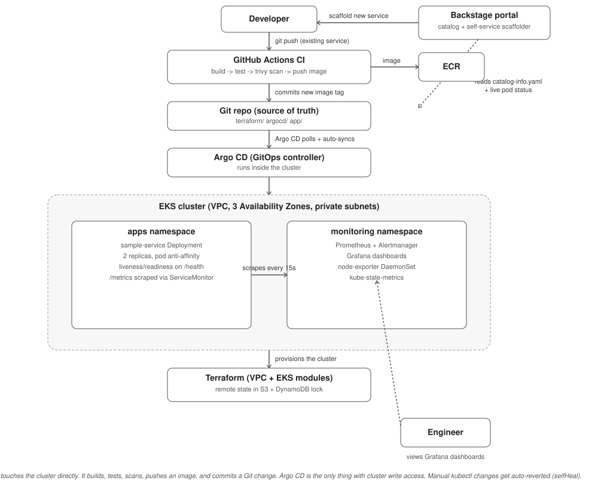

# Internal Developer Platform (IDP) — Portfolio Reference Project

A minimal but real Internal Developer Platform: Terraform-provisioned EKS, Argo CD for GitOps,
Prometheus/Grafana for observability, and a sample microservice with a build → test → scan → deploy
pipeline. Every design decision below is written down on purpose — the goal of this repo is to be
able to defend it, line by line, in a system-design interview.



---

## What this actually is

A **platform team's job** is to build the paved road so product teams stop reinventing
infrastructure. This repo is that paved road, scaled down to something one person can stand up
and fully understand:

- **Terraform** provisions the network and the Kubernetes cluster (the platform's foundation).
- **Argo CD** is the only thing with write access to the cluster (GitOps, not `kubectl apply`).
- **Prometheus + Grafana** give every team metrics and dashboards for free, on day one.
- **Backstage** is the front door — a software catalog of every service, a self-service
  scaffolder for new ones, and live Kubernetes/CI status in one portal.
- **A sample microservice** shows the "golden path" a product team actually follows.
- **GitHub Actions** proves the pipeline: build → test → scan → deploy, with security gates.

Without Backstage, this repo is infrastructure a platform team understands. With it, this repo is
a platform a *developer who has never touched Terraform or Kubernetes* can self-serve from — that
distinction is the actual difference between "cloud infrastructure" and an "Internal Developer
Platform," worth stating exactly that way if an interviewer asks what an IDP even is.

## Repository layout

```
.
├── terraform/
│   ├── modules/
│   │   ├── vpc/            # network layer: VPC, subnets, NAT, routing
│   │   └── eks/             # EKS control plane + managed node group + IAM
│   └── envs/dev/            # the only root module you actually `terraform apply`
├── argocd/
│   ├── bootstrap/root-app.yaml   # the one manifest you apply by hand, ever
│   └── apps/                     # everything else — Argo CD manages itself from here
│       ├── monitoring.yaml       # Argo CD Application -> kube-prometheus-stack Helm chart
│       └── sample-service.yaml   # Argo CD Application -> app/k8s
├── monitoring/
│   └── values.yaml           # Helm values for kube-prometheus-stack
├── backstage/
│   ├── app-config.platform.yaml       # points a Backstage instance at this platform
│   └── templates/microservice-template/
│       ├── template.yaml               # Scaffolder form + steps
│       └── skeleton/                   # what gets stamped out for a new service
├── app/
│   ├── src/                  # Flask microservice + unit tests
│   ├── Dockerfile            # multi-stage, non-root
│   └── k8s/deployment.yaml   # Deployment + Service + ServiceMonitor
├── .github/workflows/ci-cd.yaml  # build -> test -> scan -> commit new image tag
└── diagrams/architecture.svg
```

## How it fits together (the flow)

1. A developer pushes a change under `app/`.
2. **GitHub Actions** runs unit tests, builds the Docker image, scans it with **Trivy**
   (fails the build on CRITICAL/HIGH CVEs), pushes the image to ECR, then commits the new
   image tag into `app/k8s/deployment.yaml` — **CI never touches the cluster**.
3. **Argo CD**, already watching the repo, detects the Git change and syncs the cluster to match.
4. The new pods come up, Prometheus scrapes their `/metrics` endpoint via the `ServiceMonitor`,
   and the change is visible in Grafana within 15 seconds.
5. If anyone runs a manual `kubectl edit` against the cluster, Argo CD's `selfHeal` reverts it —
   Git is the only accepted source of truth.
6. A developer who wants a **new** service never touches Terraform, Argo CD, or `kubectl` at all —
   they open Backstage, fill in three fields on the `golden-path-microservice` template, and get a
   new repo with the same CI pipeline, Dockerfile, and `ServiceMonitor` pattern already wired in.
   The platform team reviews one PR (adding the new Argo CD Application) instead of building the
   service's infrastructure by hand.

## Backstage — the developer-facing layer

Everything above this section is infrastructure a **platform team** understands. Backstage is what
turns it into something a **product engineer** can use without reading any of it.

| Piece | File | What it does |
|---|---|---|
| Software catalog | `app/catalog-info.yaml` | Registers `sample-service` (and the cluster + the platform itself as a `System`) so it's browsable, with live GitHub Actions status and links to docs |
| Self-service scaffolder | `backstage/templates/microservice-template/template.yaml` | A form (service name, description, owner) that stamps out a new repo from `skeleton/` — the same Flask/Dockerfile/k8s/ServiceMonitor pattern as `app/`, parameterized |
| Kubernetes visibility | `backstage/app-config.platform.yaml` → `kubernetes:` block | Lets a developer see live pod/deployment status for their service without opening `kubectl` or the AWS console |
| TechDocs | `backstage/app-config.platform.yaml` → `techdocs:` block | Renders this repo's own Markdown (this README, the walkthrough doc) as the component's documentation page — docs live and get reviewed next to the code, not in a separate wiki |

### Backstage-specific decisions & trade-offs

| Decision | Why | What I gave up |
|---|---|---|
| `catalog-info.yaml` lives inside `app/`, not a central registry repo | Catalog entry moves/deletes in lockstep with the service — can't silently go stale | A platform-wide catalog view requires scanning many repos instead of reading one file |
| Scaffolder template opens a PR to add the new Argo CD Application, rather than committing directly | A platform engineer reviews every new service before Argo CD manages it — prevents a typo'd template run from silently taking over cluster resources | Self-service isn't fully "zero-touch" — there's still one human approval step by design |
| Only 3 required fields in the scaffolder form (name, description, owner) | Every extra required field pushes developers back toward copy-pasting the old folder by hand instead of using the portal | Less upfront customization than a longer form — advanced options become follow-up PRs instead |
| Kubernetes plugin reads the real cluster Terraform provisioned, not a separate read replica of state | Developers see truth (live pod status), not infrastructure-as-code intent | Backstage now has a runtime dependency on cluster network reachability, not just Git |

This loop — **CI does delivery (build/test/scan/publish), Argo CD does deployment (sync to
desired state)** — is the single idea that answers most "how does your pipeline work" interview
questions about this project.

---

## Design decisions & trade-offs (read this before the interview)

| Decision | Why | What I gave up |
|---|---|---|
| **Terraform, not ClickOps or CDK** | Provider-agnostic, huge ecosystem, the de facto industry standard — the same skill transfers to Azure/GCP | CDK/Pulumi give you real programming constructs (loops, classes) that HCL lacks |
| **3 Availability Zones, not 2** | Real HA — losing one AZ still leaves 2 for quorum-sensitive workloads | ~50% more NAT Gateway cost than a 2-AZ or single-NAT design |
| **One NAT Gateway per AZ** | Removes a cross-AZ single point of failure for private-subnet egress | ~3x the cost of a single shared NAT Gateway — a real cost/reliability trade-off, called out explicitly in `terraform/modules/vpc/main.tf` |
| **Managed node group, not Fargate-only** | DaemonSets (node-exporter) require real nodes; Fargate can't run them, and per-pod Fargate pricing roughly doubles cost at this scale | Lose Fargate's "never patch a node" benefit — node AMI patching is now on us |
| **Public + private EKS API endpoint** | Lets a portfolio reviewer/interviewer actually reach the cluster without a VPN | In a real enterprise platform this would be private-only behind VPN/Direct Connect — documented as a scope cut, not an oversight |
| **Remote state (S3 + DynamoDB lock), not local state** | Makes concurrent `terraform apply` from two engineers (or CI) safe | One more piece of infrastructure to bootstrap before Terraform even runs |
| **Argo CD "app of apps" pattern** | After one manual bootstrap, every future change is a pull request, never a `kubectl apply` — this is the actual definition of GitOps | Slightly more indirection to trace ("which file deploys what") than a flat list of Applications |
| **kube-prometheus-stack Helm chart, not hand-rolled manifests** | Battle-tested, bundles the Prometheus Operator + node-exporter + kube-state-metrics + Grafana with sane defaults | Less control over exact resource shape than writing every manifest by hand |
| **10-day metric retention, no remote_write** | Keeps the dev cluster cheap | Not production-viable long-term — a real platform adds Thanos/Mimir for long-term storage; documented as a deliberate scope cut |
| **CI commits a Git change instead of running `helm upgrade`/`kubectl apply`** | Every deploy has a commit hash, a PR trail, and `git revert` as an instant rollback; CI never needs cluster credentials at all | One extra round-trip (commit -> Argo CD detects -> syncs) adds a few seconds of latency vs. a direct push-based deploy |
| **GitHub Actions OIDC federation into AWS, no static access keys** | No long-lived AWS credentials sitting in GitHub Secrets waiting to leak | Slightly more setup: an IAM role with a trust policy scoped to the specific repo/branch |
| **Trivy for scanning, not a paid SCA tool** | Free, fast, covers OS packages and app dependencies, fails the build on CRITICAL/HIGH | Less depth than a commercial tool (e.g. no license-compliance scanning, weaker remediation guidance) |
| **2 replicas + pod anti-affinity for the sample service, not 1** | Cheapest possible HA — one node drain never takes the whole service down | Double the baseline compute cost of a single-replica deployment |
| **Flask + prometheus_client, not a heavier framework** | The service exists to demonstrate the platform pattern (health probe + metrics endpoint), not to showcase framework choice | Not representative of a "real" production service's complexity |

---

## Prerequisites to actually run this

- AWS account with billing alerts enabled, and an IAM user/role with permission to create VPCs, EKS clusters, and IAM roles
- An S3 bucket + DynamoDB table for Terraform remote state (create these once, manually, before first `terraform init`)
- `terraform` >= 1.7, `aws` CLI, `kubectl`, `helm`
- A container registry (this repo assumes ECR)
- Replace every `YOUR_USERNAME`, `YOUR_REGISTRY`, and `ACCOUNT_ID` placeholder in this repo with your own values before applying

## How to stand it up

```bash
# 1. Provision the network + cluster
cd terraform/envs/dev
terraform init
terraform apply

# 2. Point kubectl at the new cluster
aws eks update-kubeconfig --region ap-south-1 --name idp-dev-eks

# 3. Install Argo CD itself (one-time, official manifests)
kubectl create namespace argocd
kubectl apply -n argocd -f https://raw.githubusercontent.com/argoproj/argo-cd/stable/manifests/install.yaml

# 4. Bootstrap the app-of-apps — after this, Argo CD manages itself from Git
kubectl apply -f argocd/bootstrap/root-app.yaml

# 5. Watch it sync
kubectl get applications -n argocd
```

From this point on, every change to `argocd/apps/`, `app/k8s/`, or `monitoring/values.yaml` is
picked up automatically — you never run `kubectl apply` again.

### 6. Stand up Backstage (separate application, run once)

Backstage is its own Node.js app, not something you `kubectl apply` — you scaffold it once, then
merge in the config from this repo:

```bash
npx @backstage/create-app@latest --path backstage-app
cd backstage-app
# merge backstage/app-config.platform.yaml from this repo into app-config.yaml,
# replacing YOUR_USERNAME / YOUR_GITHUB_ORG / K8S_CLUSTER_URL with real values
yarn dev
```

Open `http://localhost:3000`, go to **Create** → **golden-path-microservice** to scaffold a new
service, or **Catalog** to see `sample-service` with its live CI status and Kubernetes pod health.

## How to tear it down

```bash
kubectl delete -f argocd/bootstrap/root-app.yaml   # removes Argo-managed resources
cd terraform/envs/dev
terraform destroy                                    # removes the cluster and network
```

---

## What I'd change for a real production platform (say this in the interview)

- Move Prometheus to remote_write into Thanos/Mimir for long-term retention and multi-cluster queries
- Make the EKS API endpoint private-only, behind VPN/Direct Connect
- Add an OPA/Gatekeeper policy layer so `argocd/apps/` submissions are validated before sync (resource limits set, no `:latest` tags, required labels)
- Add a service mesh (Istio/Linkerd) once the number of services in `apps/` grows past a handful, for mTLS and traffic shaping between them
- Split `envs/dev` into `envs/dev`, `envs/staging`, `envs/prod` with separate state files and promotion via PR, not by hand
- Make the scaffolder's `argocd-app` step actually open a PR via the GitHub API (it's a placeholder in this repo) instead of requiring a manual follow-up
- Add a Backstage plugin exposing DORA metrics (deploy frequency, change failure rate) per service, sourced from the CI pipeline's own run history

This "what I'd change at scale" list is deliberate — it's the difference between an answer that
sounds like a tutorial and one that sounds like judgment.
